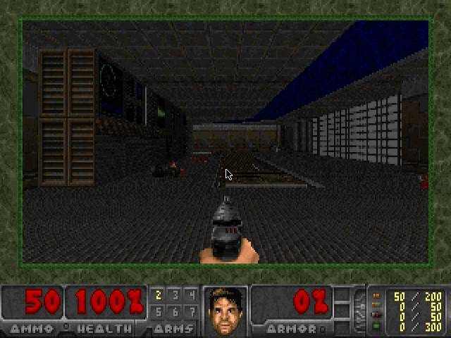

# zCX DOOM

Classic DOOM, running headless in a container and playable over VNC.

This is a fork of [storax/kubedoom](https://github.com/storax/kubedoom) (which
let you kill Kubernetes pods by shooting them in Doom) with all of the
Kubernetes integration removed: no `kubectl`, no pod/namespace killing, no
cluster RBAC. What's left is just the container plumbing to run DOOM headless
and expose it over VNC.

kubedoom itself is a fork of the excellent
[gideonred/dockerdoomd](https://github.com/gideonred/dockerdoomd) using a
slightly modified Doom, forked from https://github.com/gideonred/dockerdoom,
which was forked from psdoom.



## Running Locally

In order to run locally you will need to

1. Run the zcxdoom container
2. Attach a VNC client to the appropriate port (5901)

### With Docker

```console
$ docker run -p5901:5900 --rm -it --name zcxdoom \
  ghcr.io/viane/zcxdoom:latest
```

### With Podman

```console
$ podman run -it -p5901:5900/tcp --name zcxdoom \
  ghcr.io/viane/zcxdoom:latest
```

### Attaching a VNC Client

Now start a VNC viewer and connect to `localhost:5901`. The password is `idbehold`:
```console
$ vncviewer viewer localhost:5901
```
You should now see DOOM! It starts on E1M1 at skill 1, keyboard-only (the
mouse is disabled). Pause the game with `ESC`.

## Building zcxdoom

The repository contains a Dockerfile to build the image:

```console
$ docker build -t zcxdoom .
```

To change the default VNC password, use `--build-arg=VNCPASSWORD=differentpw`.

The DOOM IWAD (`assets/doom1.wad`) is bundled directly in this repository, so
building the image needs no network access to a third-party WAD mirror. It is
the free/open [Freedoom](https://github.com/freedoom/freedoom) `freedoom1.wad`,
not id Software's shareware data; see `assets/doom1.wad.LICENSE.txt` for its
license. If you'd rather ship id Software's original shareware `doom1.wad`,
drop your own copy at that same path before building.
